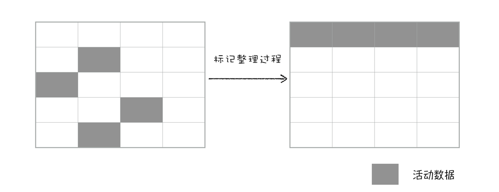
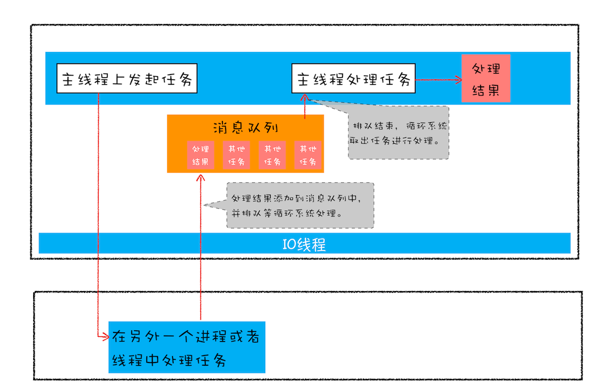
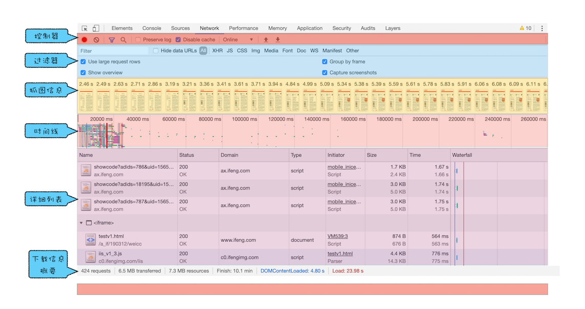
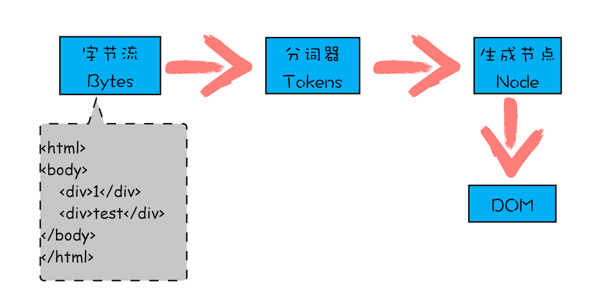

# 浏览器工作原理与实践学习笔记

## 第一章 开篇

**作者简介**

作者李兵于2005年开始工作主要经历了三个阶段

第一阶段：2008 chronium开源后，参与开发了双核浏览器太阳花（支持IE特性的chronium浏览器），日活达到20w，主要研究了chronium的进程架构和渲染流程

第二阶段：2011年加入盛大创新院参与WebOS的项目，负责H5特性的实现如：Web Workers、Application Cache、LocalStorage、IndexedDB、CSS3 部分动画效果等。主要研究了浏览器渲染流程和H5的发展趋势

第三阶段：之后去了顺网科技开发了网吧使用的F1浏览器日启动量2000w+。主要研究了浏览器安全和性能优化方面


**浏览器历史和趋势**

**历史**

1995年 网景公司开发了网景浏览器，并试图开发依托于浏览器的操作系统。微软感到了威胁同年发布的win95中捆绑了IE浏览器。

2002年 IE浏览器年达到了80%的市场占有率

2008年 google发布了chrome浏览器并开源其内核chronium，chronium采用了全新的架构在速度和安全方面有着绝对优势

2010年 google发布了网络操作系统ChromeOS

2016年 google浏览器占有率达到63% 

**趋势**

应用程序web化

web应用移动化：google推出PWA方案整合web和native的优势

web操作系统化：1. 如ChromeOS一般的浏览器操作系统 2. 浏览器SOA重构，演化为前端程序的操作系统，操作系统之上的操作系统。


**为什么需要学习浏览器工作原理？**

浏览器和前端开发的关系，就好比JVM和JAVA，编译器对于C的关系。学习了解浏览器原理能够了解前端生态，底层技术的实现和一些限制制约以及打破限制的发展趋势。

1. 准确评估 Web 开发项目的可行性

2. 从更高维度审视页面提高用户体验，一些影响体验的指标

   - 一秒内看到页面关键内容
   - 100ms用户操作无响应
   - 动画没有达到60fps/**16.6ms**（浏览器刷新频率）

   不了解浏览器只懂代码，你会发现从输入URL到页面展示对程序员来说都是黑盒。了解了浏览器的原理可以从梗高的角度定位问题所在：比如，首屏的显示就涉及了 DNS、HTTP、DOM 解析、CSS 阻塞、JavaScript 阻塞等技术因素

3. 在快节奏的技术迭代中把握本质

   NodeJS的出现导致了前端技术出现了爆发式的增长，了解浏览器的机制可以把握前端技术的脉络，当前的不足1和以后的发展趋势。当前前端技术的核心诉求

   - 脚本的执行机制：新的标准如ES2015+，新的语言WebAssembly
   - 前端模块化开发：Web components，shadow dom，HTML template，React，Vue，angular
   - 渲染效率：目前渲染存在一些问题，chrome团队提出新的方案LayoutNG（布局）和slim Paint（渲染）

**答疑**

浏览器四大功能：浏览器安全，浏览器网络，浏览器渲染，V8执行机制

浏览器干了哪些事儿：网络请求回资源，展示给用户（导航和渲染），响应用户操作（V8），重绘展示页面，保证安全

排版引擎：Blink，WebKit ， Gecko


## 宏观视角下的浏览器（6讲）

### 01 | Chrome架构：仅仅打开了1个页面，为什么有4个进程？

> 浏览器主要包括：网络，插件，渲染引擎（Blink/webkit/Gecko）, JS引擎（V8）,安全等模块
>

**并发，线程和进程**

并发是指同时运行多个计算任务，通常有多线程和多进程两种方式。线程和进程的主要区别有：

进程操作系统分配资源的最小单位，线程必须依附进程存在，同一进程的不同线程共享进程的资源。
进程中的线程崩溃会导致进程崩溃，进程结束后操作系统会回收进程的所有资源包括溢出的内存。进程间资源相互隔离。需通过IPC进行通信

**浏览器架构演进**

**单进程浏览器**

单进程的问题有：

- 不稳定：插件崩溃，某页面崩溃导致浏览器崩溃
- 不流畅：某插件/页面发生性能问题会导致整个浏览器变慢
- 不安全：因为所有页面/插件等都存在于一个进程中，内存等资源是公用的


**多进程浏览器**

解决了单进程浏览器的三大问题

* 浏览器进程
* 渲染进程
* 网络进程
* 插件进程


**进化的多进程浏览器**

多进程的问题：系统为每个进程分配资源多进程意味着更高的资源占用，多进程的架构增加了系统的复杂性（IPC等）

**未来的SOA浏览器架构**


**答疑**

同一站点的页面打开的子页面共享一个进程：process-per-site-instance


### 02 | TCP协议：如何保证页面文件能被完整送达浏览器？

> TCP协议的可靠传输保证数据能够到达目标主机

FP (first paint) 决定了用户跳出率，pv（page view）和转换率，网络因素是决定FP的一个重要原因


IP网络层协议（ip地址），负责将数据包加上IP报头（源地址，目的地址，ttl等）从一台机器运送到另一台机器(per ip), IP数据包有固定长度，会将大数据切分成很多IP数据包传输

UDP（port）传输层协议，负责将数据从一个应用运送到另一个应用，每个应用发送接受数据前需要绑定一个端口号。速度快，但不保证数据的完整性，适用于音视频，游戏等对数据完整性不高的应用。也有基于UDP开发的可靠协议如：QUIC。
不可靠，没有确认机制，重发机制。数据丢失举例：接收方未在自定端口开始监听，数据已发出

TCP（port）和UDP相同，TCP是基于连接的协议通过三握手建立连接，接收方需要发送确认数据包，四次挥手断开连接。DOS攻击


数据包的收发过程就类似于快递的收发过程：

应用层 -- 应用自己的协议（会话层，表示层，控制层）  包/拆包装
传输层 --多任务 tcp udp                                                      收件人，门牌号
网络层 ip -- 广域网，路由表，ARP，ICMP--劫持路由      地址-到家 
数据连路层 mac--唯一，局域网，FDDI, Ethernet            仓库，分公司，物流系统--路线，分发
（以太网帧）
↑物理层 -- 信源流，比特流，传输                                       水陆空基础设施


### 03 | HTTP请求流程：为什么很多站点第二次打开速度会很快？

> 因为HTTP为了提高效率设计了很多缓存机制

**浏览器的请求流程**

**客户端发起请求**

1. 构建请求，uri，http版本，请求方法（get，post，put，delete，head，option...）

2. 查找本地缓存，根据cache-control字段，max-age：xxxx（s）,no-cache(使用缓存需要和服务器通信确认), no-store（不保留缓存），如果命中缓存且没有过期则使用缓存。状态码200，from memory cache/from disk cache

3. 准备IP地址，查找DNS缓存

4. 请求排队，（同域名Chrome最多同站存在6个连接）

5. 建立TCP连接，三握手

6. 发送http请求

**服务器响应**

200：请求成功

304：使用之前的缓存，判断如果服务端资源没有改变则返回304状态码

etag/if-none-match(1.1)：etag为上一次该资源响应头所带的hash号，请求时使用if-none-match发送给服务器端

last-modified/if-modified-since(1.0)：这对值得单位是s，没有etag这组精确

浏览器收到响应后更新本地缓存，并应用

301/302：重定向

断开连接：除非请求头中存在`keep-alive`字段

ttfb参数可以看成是请求发出到接收到第一个字节的时间


### 04 | 导航流程：从输入URL到页面展示，这中间发生了什么？


* 用户发出 URL 请求到页面开始解析的这个过程，就叫做导航

* 首先，浏览器进程接收到用户输入的 URL 请求，浏览器进程便将该 URL 转发给网络进程。

* 然后，在网络进程中发起真正的 URL 请求。

* 接着网络进程接收到了响应头数据，便解析响应头数据，并将数据转发给浏览器进程。
* 浏览器进程接收到网络进程的响应头数据之后，发送“提交导航 (CommitNavigation)”消息到渲染进程；
* 渲染进程接收到“提交导航”的消息之后，便开始准备接收 HTML 数据，接收数据的方式是直接和网络进程建立数据管道；
* 最后渲染进程会向浏览器进程“确认提交”，这是告诉浏览器进程：“已经准备好接受和解析页面数据了”。浏览器进程接收到渲染进程“提交文档”的消息之后，便开始移除之前旧的文档，然后更新浏览器进程中的页面状态。


### 05+06 | 渲染流程：HTML、CSS和JavaScript，是如何变成页面的？

> 渲染流水线：解析HTML->构建DOM->计算样式（CSSOM)->布局->分层->绘制->光栅化->显示


1.  生成DOM

   渲染进程将 HTML 内容转换为能够读懂的 DOM 树结构。（parse html）预解析，分词

   window.document

2. 计算样式（calculate style）

   渲染引擎将 CSS 样式表转化为浏览器可以理解的 styleSheets，计算出 DOM 节点的样式。继承，层叠，标准化

   window.document.styleSheets

3. 布局，生成布局树（layout tree）

   并计算元素的布局信息。display:none，几何位置(height, left等），反写dom

   布局阶段将计算的结果写回dom树，dom树既是输入又是输出效率低，layoutNG正在研发中

   

4. 分层，生成层树（layout tree）

   对布局树进行分层，并生成分层树。

   什么样的元素会被单独放到一层中

   第一点，拥有层叠上下文属性的元素会被提升为单独的一层。

   第二点，需要剪裁（clip）的地方也会被创建为图层。剪裁的内容，滚动条

   如果一个节点没有对应的层，那么这个节点就从属于父节点的图层

5. 绘制(paint)，生成绘制列表

   为每个图层生成绘制列表，并将其提交到合成线程。

6. 栅格化（raster）

   合成线程接受到绘制列表后，将图层分成图块，并在光栅化线程池中将图块转换成位图(**GPU**)。

   视口viewport附近的图块优先级较高，为了提高效果可能会先渲染经过采样的图块

7. 合成线程发送绘制图块命令 DrawQuad 给浏览器进程。

8. 浏览器进程根据 DrawQuad 消息生成页面，并显示到显示器上。

   DrawQuad --> 提交给浏览器进程viz 的组件 -->屏幕


**重排**

更改元素的几何属性


**重绘**

更改元素的绘制属性


**合成**

更改元素的css动画trasform属性


**提高渲染效率的方法**

> 重排重绘都是在渲染主线成上进行的，尽量避免触发整个渲染流程，批量操作

1. 使用 class 操作样式，而不是频繁 操作 style
2. 避免使用 table 布局
3. 批量dom 操作，例如 createDocumentFragment，或者使用框架，例如 React
4. Debounce window resize 事件
5. 对 dom 属性的读写要分离
6. will-change: transform 做优化


### 07-11 |javascript的执行机制

> **Javascript的运行需要经过编译和执行两个阶段**
>
> 本文解释了代码中的变量寻值问题


**编译**

编译阶段会生成**执行上下文(EC, excution context)**和可执行代码，上下文的作用是为可执行代码提供**变量寻值**的环境

EC包含了：**变量环境** ，**词法坏境**，**outer**和**this**

var声明的变量，参数，函数都会放入**变量环境**中

let const声明的变量会放到**词法坏境**中

**outer**，一个函数是在外部函数/全局代码编译/执行时被创建的，创建后**outer**就确定了指向当时的**EC**

> 需要注意的是javascript比较“懒”函数中的代码只有在被调用执行时才会编译执行
>


**执行**

javascript引擎会维护一个**调用栈（Call Stack**），将当前正在执行代码对应的EC压入栈顶

Javascript引擎运行一段script的脚本(<script>标签内)为例：

* 首先会编译全局代码生成**EC**，压入call stack中然后执行全局的代码
* 当全局代码调用函数时，JS引擎会编译函数内代码生成**EC**，压入call stack, 然后执行函数内的代码
* 函数退出时会将EC从call stack中移除（如果有EC中的变量被引用，EC不会被销毁）

**递归，闭包会导致EC无法从调用栈移除，可能会导致栈溢出**，可以使用递归改成循环，尾调用优化等方法进行优化


**块级作用域的实现**

ES6前只有全局和function两种作用域，ES6添加了块级作用域

进入块级作用域时会在EC的词法环境栈中添加词法环境，块中的代码先从词法环境栈中寻值，再从EC中寻值，块中代码结束时，词法环境会从词法栈中弹出，外部代码无法访问


块级作用域不存在变量提升，不能在声明前访问变量--暂时性死区

这是因为变量的声明分为：变量创建，变量初始化(undefined)，变量赋值，词法环境只做变量创建，并不去初始化，所以暂时性死区内访问变量会报错

* var的创建和初始化被提升，赋值不会被提升。
* let的创建被提升，初始化和赋值不会被提升。
* function的创建、初始化和赋值均会被提升。


**作用域链**

> javascript的作用域链是由词法环境决定的，JS引擎<u>**解析代码**</u>，会确定代码中函数的outer EC，一般情况下就是当前的EC，而不是由调用时确定的


**闭包**

> 在 JavaScript 中，根据词法作用域的规则，内部函数总是可以访问其外部函数中声明的变量，当通过调用一个外部函数返回一个内部函数后，即使该外部函数已经执行结束了，但是内部函数引用外部函数的变量依然保存在内存中，我们就把这些变量的集合称为闭包。比如外部函数是 foo，那么这些变量的集合就称为 foo 函数的闭包。


```javascript
function foo() {
  var myName = "极客时间"
  let test1 = 1
  const test2 = 2
  var innerBar = {
    getName: function () {
      console.log(test1) return myName
    },
    setName: function (newName) {
      myName = newName
    }
  }
  return innerBar
}
var bar = foo() bar.setName("极客邦") bar.getName() console.log(bar.getName())
```


 


**函数中的this寻值**

1. 对象调用，指向对象
2. 箭头函数，指向函数创建时EC中的this
3. new操作符，指向返回object
4. call/apply/bind，指向第一个参数中
5. ::，指向前面的对象

全局代码的this指向window，严格模式下是undefined


## V8工作原理 (3讲)

### 12 | 栈空间和堆空间：数据是如何存储的？

**语言的类型**

可以分为：强类型，弱类型和动态语言，静态语言

强类型/弱类型

变量可以被赋值各种数据类型，不需要声明一种特定的类型为弱类型语言。弱：javascript，python，强：C，java

动态语言/静态语言

数据赋值给不同类型的变量时可以自动转换为动态语言。动：C，javascript，静Java，C++


**javascript的八种数据类型**

string，number，**bigint**，boolean，null，undefined，symbol，object

前七种为基础类型，object为对象类型。变量赋值基础类型为复制，对象类型为引用。

javascript引擎的内存空间模型：代码空间，栈空间，堆空间。基础类型存放在栈空间，对象类型存放堆空间。

因为对象类型占用内存比较多，放入栈空间会影响程序的运行效率。


**程序运行时的内存模型**


**在内存模型的基础上了解闭包**

函数运行前需要进行编译和创建执行上下文，编译的过程中遇到内部函数会进行快速的词法扫描，如果该函数引用了外部函数（当前正在编译的函数）的变量，则会为其创建一个闭包对象。也就是说被内部函数引用的变量没有存在栈内存中，而是被提取到了闭包对象，放到了堆内存中。内部函数中保留对该闭包对象的引用以便访问到相应的变量。

当外部函数执行完毕，执行上下文销毁时，如果内部函数仍然存在（从外部函数返回，并赋值给当前执行上下文中的变量），对于闭包对象的引用也仍然存在，那么GC就不会销毁堆内存中的闭包对象，所以内部函数仍然可以访问到闭包对象中的变量。


**使用chrome devtools了解内存模型**

打开命令行工具，在console中运行一段含有闭包的代码，切换到memory，选择heap snapshot-> take snap shot。之后搜索`setName`, 可以看到该函数对闭包对象的引用(raw_outer_scope_info_or_feedback_metadata)


### 13 | 垃圾回收：垃圾数据是如何自动回收的？

**垃圾回收的两种策略**

一般分为手动回收和自动回收两种，手动回收如：C，C++,  自动回收通过GC回收内存如：java，javascript，python


**Javascript中的垃圾回收**

根据javascript的内存模型可知，javascript的内存使用主要分为`栈内存`(用来存放执行栈EC)，`堆内存`（用来存储对象，闭包）

**栈内存的回收**

栈内存的回收时通过ESP(extended stack pointer)，当函数执行结束后，ESP会移动到上一个EC，如果有新的函数被调用，那么新的EC会覆盖原来的EC的栈内存空间


**堆内存的回收**

代际假说（The Generational Hypothesis）理论

- 第一个是大部分对象在内存中存在的时间很短，简单来说，就是很多对象一经分配内存，很快就变得不可访问；

- 第二个是不死的对象，会活得更久。

V8将内存分为两个区域`新生代`和`老生代`，新生代一般只有1-8m用来存储体积小，时间短的对象。老生代用来存储存在时间长或者体积大的对象。新生代的GC叫做副垃圾回收器，老生代的叫主垃圾回收器

垃圾回收的步骤：

1. 标记非活动对象和活动对象
2. 回收非活动对象
3. 整理内存


**新生代回收策略**

新生代使用`scavenge`回收策略，将新生代划分为`对象区`和`空闲区`，新加入的对象会被放入对象区，当对象区满了时会执行垃圾回收策略：

1. 标记：遍历栈内存，标记堆内存中没有使用的对象，没有引用的为垃圾对象，有引用的为活动对象
2. 移动：将所有活动对象移动到，空闲区
3. 交换：空闲区变为对象区，对象区变为空闲区


**老生代回收策略**

老生代使用`标记 - 清除（Mark-Sweep）`的算法进行垃圾回收，大对象，新生代回收两次仍然存在的对象会被放入老生代，老生代执行回收的策略：

1. 标记，初次标记和增量标记
2. 清除：将垃圾对象占用的内存回收
3. 整理：将内存向一个方向移动

由于GC是在主线成上运行，当GC运行时会stop-the-world，javascript的程序会被挂起，如果GC执行时间过长页面会有卡顿的现象。所以GC的过程被`分阶段执行`，中间穿插执行javascript的代码，减轻GC执行时对性能的影响。


标记 - 整理（Mark-Compact）所有内存向一侧移动



为了降低老生代的垃圾回收而造成的卡顿，V8 将标记过程分为一个个的子标记过程，同时让垃圾回收标记和 JavaScript 应用逻辑交替进行，直到标记阶段完成，我们把这个算法称为**增量标记（Incremental Marking）**算法


**如何判断javascript内存泄漏**

使用chrome devtool的`performance`功能


### 14 | 编译器和解释器：V8是如何执行一段JavaScript代码的？

机器不能直接理解和运行原代码，所以代码在运行前需要转换为机器语言。根据转换的方式和流程不同可以分为编译型语言）和解释型语言(python, javascript)


**编译语言**

编译语言由编译器（compiler）将原代码编译成可以直接运行的二进制代码，每次运行前不需要重新编译。C, C++, go, java都是编译语言


**解释语言**

解释语言由解释器 (interpreter：V8，spidermonkey，rhino) 将原代码先转换为字节码，之后按照字节码逐行解释执行。javascript， python等都是解释型语言


**V8执行一段代码的过程**

首先编译全局代码，全局中函数内部代码只做快速扫描，生成context.outer等但是并不编译，等到函数运行时才会被编译


**编译将原代码转换为AST和执行上下文**

首先进行**词法分析（tokenize）**，将原代码分词


之后进行**`语法分析`**也叫解析（**parse**），将生成的分词根据语法规则转换成AST树，如果分词的组合不符合语法规则，则报告相应的语法错误


**生成字节码**

生成AST树后，解释器（Ignition）将AST树生成字节码(之所以不直接生成机器码是因为机器码会占用更多的内存)


**运行**

`解释器（Ignition）`执行对字节码进行解释执行，如果一段代码执行多次（如被多次调用的函数）就会被标记为hotspot代码。`编译器（TurboFan）`将hotspot代码编译成可以执行的机器码，再次执行时直接调用机器码，减少了解释的时间提高了运行效率。所以使用**JIT**技术，代码 运行的越久效率就会变得越高。


PS:

AST的应用：babel，eslint


## 浏览器中的页面循环系统 (6讲)

### 15 | 消息队列和事件循环：页面是怎么“活”起来的？

> 除了合成其他任务基本都在主线程上运行，浏览器通过事件循环和消息队列调度执行这些任务


渲染主线程中存在**消息队列（event queue）**和**事件循环（event loop）**，事件循环（event loop）依次从队列头部取出任务执行。任务中的同步代码放在主线成中执行，异步代码会在**event table**中注册异步事件和回调函数，当异步事件完成，回调函数会被放入消息队列中。异步任务分为**宏任务（macro task）**和**微任务（micro task）**宏任务会被放入主线程的消息队列中，每个宏任务还会维护一个微任务队列，用于存放宏任务运行过程中产生的微任务，当宏任务结束后会先执行微任务队列中的任务。


微任务的意义: 宏任务中存在比较重（耗时长，资源占用多）的任务时，如果设计成同步的，则会影响后续的任务执行，造成卡顿，如果使用宏任务（如setTimeout) 那么，该任务执行的时机不可预测取决于消息队列中有多少个排队任务，和主任务脱节。微任务很好的解决了这个问题：

例如：执行顺序：task->stask1->stask3->stask2 .... task2....

task

-> stask 1

-> stask 2 (heavy) -- Promise

-> stask 3

task2

task3

task4

.....


**产生异步任务的API**

**宏任务**

| #                     | 浏览器 | Node |
| --------------------- | ------ | ---- |
| setTimeout            | √      | √    |
| setInterval           | √      | √    |
| setImmediate          | x      | √    |
| requestAnimationFrame | √      | x    |
| dom事件               |        |      |
| XMLHttpRequest        |        |      |
| 浏览器渲染（内部）    |        |      |


**微任务**

| #                                             | 浏览器 | Node |
| --------------------------------------------- | ------ | ---- |
| process.nextTick                              | x      | √    |
| MutationObserver                              | √      | x    |
| Promise.resolve，reject （而不是then，catch） | √      | √    |

**安全退出**

主线程中的事件循环何时退出？当每执行完一个宏任务时会查看退出标识，如果为真则退出


浏览器事件/任务举例：

- 当接收到 HTML 文档数据，渲染引擎就会将“解析 DOM”事件添加到消息队列中，

- 当用户改变了 Web 页面的窗口大小，渲染引擎就会将“重新布局”的事件添加到消息队列中。

- 当触发了 JavaScript 引擎垃圾回收机制，渲染引擎会将“垃圾回收”任务添加到消息队列中。

- 同样，如果要执行一段异步 JavaScript 代码，也是需要将执行任务添加到消息队列中。


### 16 | WebAPI：setTimeout是如何实现的？

主线程中维护一个**延迟队列**delaytaskqueue用于存放延迟的任务，每个宏任务结束后会计算到时间了的delay task

,将这些task的回调函数放到**消息队列**中

**setTimeout的问题**

1. 不一定会在指定的时间后执行，真正的执行时间=当前宏任务的执行时间+队列中的宏任务执行时间(>=设置的延迟时间）
2. 嵌套调用5次以上，浏览器认为被阻塞了，会设置最小间隔为4ms
3. 未激活页面最小为1000ms
4. 延时最大值 32bit，2147483647 毫秒，约 24.8 天，超出会被设置为0

setTimeout不适合于做动画1. 执行时间不定，2. 执行后和刷新频率不一致会导致丢帧卡顿等问题


**动画原理**

视觉暂留

刷新频率 60HZ 16.7ms每次


**requestAnimationFrame**

1. 由**系统调用**（不用指定时间）保证每次刷新时渲染函数都能执行
2. CPU节能非激活的tab不执行
3. 节流，每个帧只执行一次
4. 也在事件队列中，执行时机会受到宏任务的影响


### 17 | WebAPI：XMLHttpRequest是怎么实现的？


**回调的类型**

同步回调，系统回调（异步）。异步回调又分宏任务和微任务


**XMLHttpRequest**的请求通过IPC调用网络进程处理，收到请求后由网络进程通过IPC，将结果封装成任务放到消息队列中


**XMLHttpRequest**请求过程

1. 创建对象 var xhr = new XMLHttpRequest()
2. 注册事件监听 xhr.onReadyStateChange, xhr.onTimeout, xhr.onError
3. 打开连接xhr.open(method, url, async)
4. 配置请求参数，xhr.responseType,  xhr.setRequestHeader, xhr.timeout...
5. 发送xhr.send

**XMLHttpRequest**请求的坑

1. 跨域问题，同源策略（通过代理/allow）
2. 混容问题，https的页面，通过XMLHttpRequest访问http资源被禁止


### 18 | 宏任务和微任务：不是所有任务都是一个待遇

**宏任务**

- 渲染事件（如解析 DOM、计算布局、绘制）；
- 用户交互事件（如鼠标点击、滚动页面、放大缩小等）；
- JavaScript 脚本执行事件；
- 网络请求完成、文件读写完成事件。
- 垃圾回收

**微任务**

- Promise.resove, Promise.reject
- MutationObserver

每个宏任务会维护一个微任务队列，宏任务执行结束时会有一个**检查点**如果微任务队列中有待执行的任务，会将任务依次放入执行栈执行，执行过程中产生的微任务也会放入微任务队列。继续执行。所有微任务都执行后退出宏任务。


**监听 DOM 变化方法演变**

dom事件，onclick, onscroll....触发javascript回调函数

轮询

Mutation Event：采用同步机制实时性高，但影响执行效率（单线程阻塞其他任务主线成任务执行）

MutationObserver：采用异步机制+微任务，提高效率（1：异步不阻塞， 2. 由于微任务在宏任务之后执行，可以合并操作），微任务的执行在宏任务之后其他宏任务之前，实时性页能得到保证


### 19 | Promise：使用Promise，告别回调函数

promise并不是一种新的语法或者技术，只是一种工具类，一种中间对象将异步编程的嵌套形式改为链式调用的形式。


**为什么要用异步编程**

页面的任务都是在渲染进程的主线程执行的--单线程（解析，渲染，绘制，交互，执行JS...）,为了避免耗时任务霸线（timeout，xhr，cpu等资源闲置），采用异步机制将耗时任务交给其他线程和进程去执行，结束之后将结果和回调函数封装成任务加入消息队列。等待主线成空闲时处理。**浏览器的架构机制决定了异步编程机制**



**异步编程风格进化**

1. 封装基础api，隐藏api的异步函数定义细节，提供统一的输入输出（axios）。输入使用参数，输出使用回调函数的形式。问题是当后续逻辑依赖于前面的回调时会形成**回调地狱**，而且每层回调带有成功，失败两个分支
2. Promise -- 从嵌套变为串行
   1. 延迟绑定--resolve/reject-->微任务
   2. 返回值穿透
   3. 异常冒泡

**作业：promise的实现**

PS

### 20 | async/await：使用同步的方式去写异步代码

使用promise处理连续的异步任务时需要写一堆then/catch的链，这些连与业务无关主要为了控制代码流程，影响阅读。

**ES7**中引入了async/await的语法，允许以同步风格书写异步代码（不会阻塞主线程）。主要运用了底层的promise，生成器（generator函数）和执行器


**生成器**（generator）

是一种可以暂停和恢复执行的函数，父协程可以通过调用gen.next(), 将控制权限转到子协程，使用子协程的CallStack 同时保存父协程的CS。子协程中通过`yield`将控制权返回给父协程，同时恢复父协程的CS。这种工作方式叫做：协程（Coroutine），比线程更轻量的，多段程序交替执行 vs 顺序执行


**执行器**

执行器负责自动执行生成器，直到生成器的所有代码完成，省去了父协程中手动调用next的过程


**async/await**

async函数始终返回一个Promise对象(await/return)，如果返回值不是Promise则调用Promise.resolved()封装

async函数的代码执行到await后的语句时停止执行，将语句结果包装成promise返回给主协程。promise应该自带一个then方法，调用async（子协程）的next。当promise对象编程resolved/reject后。控制权转到子协程。


```javascript

async function foo() {
    console.log('foo')
}
async function bar() {
    console.log('bar start')
    await foo() // 执行到此处，foo返回Promise.resolved(undefined)微任务中增加微任务，微任务内容未继续执行协程bar中的内容，值为undefined
    console.log('bar end')
}
console.log('script start')
setTimeout(function () {
    console.log('setTimeout')
}, 0)
bar();
new Promise(function (resolve) {
    console.log('promise executor')
    resolve();
}).then(function () {
    console.log('promise then')
})
console.log('script end')

/*
script start
bar start
foo ---> await foo: Promise.resolved(undefined)--协程
promise executor
script end
bar end 微任务->协程
promise then 微任务
setTimeout 宏任务
*/
```


### 总结

浏览器渲染进程负责页面渲染，很多任务都是在主线程上执行的（html解析，执行javascript，渲染页面，响应事件），为了防止耗时任务霸线导致程序卡顿。采用消息队列+事件循环的异步机制，将耗时任务调度到异步执行

模型：

事件循环，宏任务队列，延迟任务队列，微任务队列，event table，IO线程

异步编程：

- 系统api
- 封装+callback
- promise
- async/await


## 浏览器中的页面(8讲)

### 21 | Chrome开发者工具：利用网络面板做性能分析





**排队queuing**

1. 非核心资源给核心资源（js，html，css）“让路”

2. 同域名下最大连接数限制6 **:域名分片，http2**
3. 网络进程分配磁盘空间

**Stalled**

其他原因导致的连接延迟，一般会很短

**Proxy Negotiation**

如果使用了代理会有代理协商

**DNS lookup**

如果remote不在dns缓存中会有dns查找的过程

**Initial connection/SSL **

建立连接，ssl协商

**request sent**

发送请求数据包

**waiting TTFB(Time To First Byte)**

请求发送后，接受到第一个字节的时间 = 网络传输x2+服务器处理时间

解决方案：服务器端提高处理速度，使用缓存技术等，使用CDN缓存静态资源，减少不必要的cookie

**Content Download**

第一字节到下载完成所有数据所用时间

解决方案：减小体积


### 22 | DOM树：JavaScript是如何影响DOM树构建的？

**DOM**

网络下载的html文件字符流，无法被渲染引擎理解，DOM 是表述 HTML 的内部数据结构，它会将 Web 页面和 JavaScript 脚本连接起来，并过滤一些不安全的内容（**XSSAuditor**）。

**DOM解析**

网络进程下载数据后会请求选择/创建渲染进程，建立管道，渲染进程将数据输入给**HTML解析器**，解析过程是变下载边解析的




**JavaScript 是如何影响 DOM 生成的**

1. 如果解析过程中遇到内嵌的javascript，会阻塞解析过程，将javascript代码交给JS引擎去处理
2. 外嵌的会先下载，再执行
3. 异步script（defer和async）不会阻塞当前的执行，defer DOMContentLoaded, async: 啥时候回来啥时候执行
4. CSS会阻塞Javascript的执行

Chrome中有**<u>预解析操作</u>**优化阻塞。当渲染引擎收到字节流之后，会开启一个预解析线程，用来分析 HTML 文件中包含的 JavaScript、CSS 等相关文件，解析到相关文件之后，预解析线程会提前下载这些文件。


### 23 | 渲染流水线：CSS如何影响首次加载时的白屏时间？

渲染流水线渲染，javascript的执行(如果之前有css)需要将css转换为cssom，转换的过程就会造成阻塞

> cssom可以通过`document.styleSheets`访问


```html

<html>
<head>
    <link href="theme.css" rel="stylesheet">
</head>
<body>
    <div>geekbang com</div>
    <script src='foo.js'></script>
    <div>geekbang com</div>
</body>
</html>
```


### 24 | 分层和合成机制：为什么CSS动画比JavaScript高效？
> 因为css动画在合成阶段中执行，渲染流水线，并且在合成线程执行不会阻塞主线程

**显示器是怎么显示图像的**

浏览器有固定刷新频率大多数是60HZ就是一秒刷新60次，每次刷新从显卡**前缓冲区**读取位图并显示，之后后会发出vSync信号。显卡有两个缓冲区：前缓冲区和后缓冲区，后缓冲区更新数据后会和前缓冲区调换位置，以共显示器读取。好处是可以每次都显示完整的图像

显示器每次读取前缓冲区中的图像被称之为一**帧**，一秒钟能读取的帧数叫做**帧率**

**浏览器渲染优化**

渲染页面通常有重排，重绘和合成三个阶段，在合成阶段浏览器做了以下优化

**分层**

为了提高渲染效率，浏览器采用了分层机制在合成线程分别绘制不同的图层之后再合成一张图，这样做的好处是如果某一图层发生了变换(旋转，移动等)，只需要修改该图层然后再合成即可，其他图层不需要计算。大大提升了效率，并且在合成线程上执行并不会影响渲染主线成。css的动画就是发生在合成阶段直接对图层进行转换，在合成线程上进行的，页面滚动也是在合成线程上进行的

**分块**

浏览器会将图层切分成大小相等的块，优先渲染窗口附件的块。渲染每一块时，通过采样比如1/4，生成一张低分辨率的图片，然后再继续渲染完全渲染后再替换掉，缩短了用户等待的时间，提高了用户体验


**利用优化策略提升代码效率**

通过css/js将经常需要做几何/透明度/缩放变换的元素设置`will-change`属性，该元素会被单独绘制为一层，几何变换会发生在合成阶段，不会影响到其他元素导致重排，重绘，同时不会占用主线成来执行，导致阻塞

> 弊端是单独绘制一层会占用额外的内存

```css
.box {
will-change: transform, opacity;
}
```


### 25 | 页面性能：如何系统地优化页面？

> 优化下载资源
> 不要霸占主线程
> 优化javascript的执行效率
### 加载阶段
主要因素：网络下载资源，javascript执行
总的优化原则就是减少关键资源个数，降低关键资源大小，降低关键资源的 RTT 次数
如：非关键javascript设置为async或者defer

### 交互阶段
一个大的原则就是让单个帧的生成速度变快，不要一直霸线，给渲染流水线机会去渲染
1. 减少javascript执行时间
使用webworker计算，task分片如react fiber, 执行一个分片交出控制权
2. 同步布局
修改dom后马上访问该dom属性会触发一次额外的强制布局，（布局会在异步任务中执行）
3. 利用css动画
4. gc垃圾回收，频繁的创建，销毁对象

### 26 | 虚拟DOM：虚拟DOM和实际的DOM有何不同？
1. 更轻量
2. 整合收集dom操作，一次性触发渲染流程
3. mvc数据和视图解耦
4. 双缓存，防止页面无效刷新和闪屏问题


### 27 | 渐进式网页应用（PWA）：它究竟解决了Web应用的哪些问题？
> PWA(Progressive Web App), web应用移动化的一套方案，渐进式增强 Web 的优势，并通过技术手段渐进式缩短和本地应用或者小程序的距离
那相对于本地应用，Web 页面到底缺少了什么？
1. 离线
2. 消息推送
3. 一级入口

针对以上 Web 缺陷，PWA 提出了两种解决方案：通过引入 `Service Worker` 来试着解决离线存储和消息推送的问题，通过引入 `manifest.json` 来解决一级入口的问题。

Service Worker的作用
1. 在页面和服务器之间起到代理的作用拦截页面请求根据manifest.json配置决定读取本地缓存还是进行请求
2. 运行在浏览器进程中，可以在页面没有启动的情况下推送通知
3. 采用 HTTPS 协议,
`manifest.json`应用程序的配置文件，可以配置资源的访问方式，图标，显示名称，启动方式等

TODO 架构图 27-1


### 28 | WebComponent：像搭积木一样构建Web应用

> WebComponent为开发者提供了一种扩展html标签的手段和组件化开发的能力，组件化对内高内聚，对外低耦合
**WebComponent出现的原因**

单个Web应用变得越来越复杂，需要一种方式来提高研发效率那就是组件化（对内高内聚，对外低耦合）（对内高内聚封装代码提供接口，对于外解耦降低复杂度，隐藏细节，易于重用，易于测试，）

因为javascript和CSS是全局不同模块之间的代码会相互的影响的所以出现了WebComponent技术，它主要包含
* 自定义元素
* 影子 DOM
* HTML 模板

**思考：你是怎么看待 WebComponents 和前端框架（React、Vue）之间的关系的？**

WebComponents vs 前端框架（React、Vue）,就像ISO TCP/IP 7 vs 现实版TCP/IP 5层，jquery selector vs querySelectorAll, ES6 vs typescript
属于官方标准，优势是
靠近底层能够做到一些框架无法做到的事情，比如：浏览器级的性能优化，更丰富的功能
缺点：
出来晚了，现实版已经占领了很多市场移植需要成本
作为靠偏底层的技术不可能做的面面俱到那会变得很重，所以使用起来注定没有框架简单方便

未来：
1. Webcomponent发展的足够好，前端框架被Webcomponent取代，如flash被html5干掉
2. 更大的可能是并存，前端框架作为webcomponent的上层，对其进行封装利用了其优势的同时，提供了便利性

### 29 | HTTP/1：HTTP性能优化

超文本传输协议 HTTP/0.9 （1991 年学术交流）

**1991年提出主要用于学术交流，极其简单：**

* 只有get方法
* 只有请求行，没有head和body
* 只支持ascii

**超文本传输协议 HTTP/1.0 (1996, 1994拨号上网）**

> 核心诉求是提供多文件类型的的支持
* 加入了响应头标识：类型，编码，状态码等
* 加入和响应体, 传递数据
* 加入缓存机制，提高访问效率
* 加入user agent，获取客户端信息

**超文本传输协议 HTTP/1.1 (1997年1月, 1994拨号上网）**

* 持久链接
为保持传输效率，一个站点可以维持6个长连接，持久链接是默认开启的，可以在响应头中设置`Connection: close`来关闭
* 管线化
由于TCP长链接存在队头阻塞问题，1.1提出了管线化将http请求整批提交给服务器
没能成功

* 提供虚拟主机的支持，header中host字段表明当前主机地址
* 动态内容长度
Chunk transfer 机制：每个块附带上一个块的长度，最后发送一个0长度的串作为发送完成的标志
* cookie和安全机制


### 30｜HTTP/2：如何提升网络速度？

> HTTP/2多路复用：一个域名只使用一个 TCP 长连接和消除HTTP队头阻塞问题

HTTP1.1存在的问题：

第一个原因，TCP 的慢启动。

第二个原因，同时开启了多条 TCP 连接，那么这些连接会竞争固定的带宽。

第三个原因，HTTP/1.1 队头阻塞的问题。

HTTP2的改进：

1. 多路复用：TCP[TLS]和HTTP中间加入了二进制分帧层，http数据包被拆分，标号并行发送/组装
2. 可以设置请求的优先级
3. 服务器推送，请求html时服务器将关键资源一起返回
4. 头部压缩


思考：

多路复用可能的弊端，提升服务器开销，多了拆分和组装的过程，需要加入更多的信息维护完整性


### 31｜HTTP/3：甩掉TCP、TLS 的包袱，构建高效网络

> HTTP2的问题：TCP 的队头阻塞，只能抛弃TCP使用QUIC重建底层来解决


**无法通过修改TCP协议来解决**

1. 中间设备的僵化
2. 操作系统给

**解决办法QUIC 协议**

QUIC协议基于UDP集成了“TCP+HTTP/2 的多路复用 +TLS 等功能”的一套协议

HTTP/3 正是基于 QUIC 协议的


### 32 | 同源策略：为什么XMLHttpRequest不能跨域请求资源？

> 因为同源策略不允许这么做


同源策略（Same-origin policy）限制了不同源资源之间的交互，同源策略主要表现在 DOM、Web 数据和网络这三个层面：

1. DOM操作
2. Web 数据：cookie, localstorage，indexdb
3. 网络请求：xmlhttprequest

**安全和便利性的权衡**

1. 页面中可以嵌入第三方资源：通过内容安全策略CSP来保证页面的安全，如转义<>, javascript:，src等
2. 跨域资源共享CORS：在不同站点间共享资源，http options请求，headers
3. 跨文档消息通讯机制：window.postMessage


### 33 | 跨站脚本攻击（XSS）：为什么Cookie中有HttpOnly属性？

> XSS首先往浏览器中注入恶意脚本，然后再通过恶意脚本将用户信息发送至黑客部署的恶意服务器上

Cross Site Scripting

**恶意脚本是怎么注入的**

1. 存储型 XSS 攻击：利用漏洞将恶意代码上传到服务器，用户访问寒有

2. 反射型 XSS 攻击：恶意代码放到URL上，

3. 基于 DOM 的 XSS 攻击：Web 资源传输过程或者在用户使用页面的过程中修改 Web 页面的数据

**如何阻止XSS**

1. 服务器对输入脚本进行过滤或转码
2. 充分利用 CSP
   1. 限制加载其他域下的资源文件，这样即使黑客插入了一个 JavaScript 文件，这个 JavaScript 文件也是无法被加载的；
   2. 禁止向第三方域提交数据，这样用户数据也不会外泄；
   3. 禁止执行内联脚本和未授权的脚本；
   4. 还提供了上报机制，这样可以帮助我们尽快发现有哪些 XSS 攻击，以便尽快修复问题。
3. 使用 HttpOnly 属性


### 34 | CSRF攻击：陌生链接不要随便点

> Cross-site request forgery，利用了用户的登录状态，并通过第三方的站点来做一些坏事。

和 XSS 不同的是，CSRF 攻击不需要将恶意代码注入用户的页面，仅仅是利用服务器的漏洞和用户的登录状态来实施攻击


CSRF需要满足的条件

第一个，目标站点一定要有 CSRF 漏洞；

第二个，用户要登录过目标站点，并且在浏览器上保持有该站点的登录状态；请求某一域名时会带上该域名下的cookie

第三个，需要用户打开一个第三方站点，可以是黑客的站点，也可以是一些论坛。


防止CSRF攻击

1. 充分利用好 Cookie 的 SameSite 属性，strict，lax，none
2. 服务器验证请求的来源站点：http header: Referer（资源路径）, origin（域名）
3. CSRF Token：服务器生成页面时预埋token


### 35 | 安全沙箱：页面和系统之间的隔离墙

> 浏览器设置了渲染进程和内核进程两个进程保证页面被攻击后，不会进一步入侵操作系统

安全沙箱做了以下保护，操作是通过浏览器内核完成的

1. 持久存储，文件，cookie, localStorage，缓存文件等
2. 网络访问
3. 用户交互，渲染进程获取不到窗口句柄，页面展示，用户的操作
4. 站点隔离（Site Isolation），同一域名，有关联的页面（iframe，window.open）放到一个渲染进程/沙箱中


### 36 | HTTPS：让数据传输更安全

> 使用TLS层加密明文

http网络安全的进化路线

1. 对称加密，问题：密码是明文传输可能泄漏
2. 非对称加密，问题：1. 效率低，2. 客户端没有密钥对
3. 密钥非对称+http内容对称，问题：无法保证服务器的公钥是可靠的
4. 使用证书
   1. 服务器向数字证书机构（CA)申请证书
   2. CA验证后，对基本信息计算摘要，对摘要进行签名，CA本身的信息打包成证书
   3. 浏览器向服务器发起请求后会获得，服务器的cer和CA的cer
   4. 利用CA的公钥解密签名对比摘要信息后可确定服务器是否可靠
   5. 可通过CA链来确定CA是否可靠，操作系统中内置了根CA的cer


关闭阶段

导航->解析HTML->dom，cssom->layout布局树(可视，计算样式，计算位置)->layer/层树->绘制列表->合成线程->（）-> 光栅化

### 总结

### Javascript的运行过程

javascript的内存模型--context，variable，lexical，pile

javascript的运行

编译，词法语法 AST，字节码/二进制，运行。GC

变量/属性的寻值，作用域链--静态词法和原型链

作用域链，继承链


超级大图，动静结合 -- 完全理解。架构，请求，缓存，渲染，交互，关闭，各个详细阶段浏览器的表现时怎么样的

前端应用优化策略: from head to foot, 结合webpack nginx : 分级

页面加载前，页面加载，页面交互，页面关闭

HTMLDOMC'o'nen'tLoaded和loaded的意义，权威指南笔记

工具使用


## 名词、知识点
**渲染流水线**

**解析白屏**： 提交数据之后渲染进程会创建一个空白页面，我们通常把这段时间称为

**纹理上传**

**前缓冲区**

**后缓冲区**

**帧**

**帧率**

**重排**

**重绘**

**合成**：分层、分块和合成

**HTML预解析**

**DOM**

**CSSOM**： document.styleSheets，js操作接口，布局树提供信息

**RTT（Round Trip Time）**

**关键资源**: javascript css, 阻塞html解析的资源

**MVC 模式**： MVP，MVVM

**双缓存** -- 显卡，vdom

**PWA**

**web worker**

**service worker**

**WebComponent**

**W3C**

**http-wg**

**队头阻塞**

**Chunk transfer 机制**

**QUIC协议**

**同源**：如果两个 URL 的协议、域名和端口都相同，我们就称这两个 URL 同源

**同源策略**：

**XSS**：跨站脚本攻击

**CSP**：内容安全策略

**CORS**：跨域资源共享

**进程间通信(*IPC*,Inter-Process Communication)**

指至少两个进程或线程间传送数据或信号的一些技术或方法。

**FP（First Paint）**，是指从页面加载到首次开始绘制的时长

**TCP**（Transmission Control Protocol，传输控制协议）是一种面向连接的、可靠的、基于字节流的传输层通信协议。三握手，四挥手，排序，重传等机制

**UDP**（User Datagram Protocol，用户数据报协议）不可靠速度快，可以广播

**变量提升（Hoisting）**
所谓的变量提升，是指在 JavaScript 代码执行过程中，JavaScript 引擎把变量的声明部分和函数的声明部分提升到代码开头的“行为”。变量被提升后，会给变量设置默认值，这个默认值就是我们熟悉的 undefined。


## 总结(under construction)

### 浏览器架构

分解图 -- 挂上所有知识点 == xmind 周四

加载 -- 交互 -- 关闭 ++事件
dns/缓存/
缓存 memory/disk, header hash...

这种架构好处，安全性+xxx稳定+

渲染进程所有的外部通讯都需要通过浏览器进程


### 浏览器是如何调度任务的

event loop等帧的开始信号么
事件循环和消息队列 -- 属于渲染进程么？应该不属于

常用的task


### 页面是如何渲染的

导航

解析

渲染：布局树（样式计算，样式布局）

-->交互阶段 重排，重绘，合成


### 浏览器中的javascript

如何执行

内存模型，回收


### 性能和优化

加载阶段，交互阶段，关闭阶段

网络优化

javascript优化

减少内存，16.6s，css动画

渲染优化

requestAnimationFrame

requestIdleCallback


**提高渲染效率的方法**
尽量避免触发整个渲染流程，批量操作

1. 使用 class 操作样式，而不是频繁 操作 style
2. 避免使用 table 布局
3. 批量dom 操作，例如 createDocumentFragment，或者使用框架，例如 React
4. Debounce window resize 事件
5. 对 dom 属性的读写要分离
6. will-change: transform 做优化


### 安全

页面，系统，网络


### 网络


## 参考连接
* 教程地址

  https://time.geekbang.org/column/article/116572

  https://time.geekbang.org/column/article/113513

* React Fiber 更新机制

* chromium源码

* blinkon上有一些深入讲解内核的视频

* http发展历史
  https://blog.csdn.net/liujianfei526/article/details/53289350

* 三次握手，四次挥手
  https://www.cnblogs.com/AhuntSun-blog/p/12028636.html

* http状态码
  https://baike.baidu.com/item/HTTP%E7%8A%B6%E6%80%81%E7%A0%81/5053660?fr=aladdin

* http缓存机制
  https://blog.csdn.net/weixin_40817115/article/details/86707180

  https://developer.mozilla.org/zh-CN/docs/Web/HTTP/Caching_FAQ

* 同源策略：https://www.ruanyifeng.com/blog/2016/04/cors.html

* CSP: https://developer.mozilla.org/zh-CN/docs/Web/HTTP/CSP

* 安全沙箱: https://time.geekbang.org/column/article/155183

* 免费证书：https://freessl.cn/

* 层叠上下文属性

  https://developer.mozilla.org/zh-CN/docs/Web/Guide/CSS/Understanding_z_index/The_stacking_context


## 问题和练习
* javascript修改dom是同步的还是异步的，除了强制布局外

* cssom是什么时候构建的

* 一边parse 一边渲染么？

* 渲染是在另外的task中进行的，为什么javascript执行过程中修改dom会立即生效？打断点

* javascript运行，dom解析，等是否都是再渲染主线成上执行的?如果是的话async的请求回来后马上执行是只解析后么？如何协程的？ --  进入任务队列解析执行。**HTML解析过程交出控制权么？**

* 交互时，重新渲染的时机是什么，渲染是在宏任务肿么？除了task中的强制布局

* CSSlink类似于javascript的defer、async属性，可以不阻塞渲染

* 学习pwa: serviceworker + manifest.json配置

* 如何应用http2？

* chrome devtools如何查看http版本

* 光栅化之后是分层的图片，这些图片在哪里合成的？

* super tiny compiler编译原理

* **chrome devtools 学习**

  chrome://net-export/

* **curl** 学习

* requestActionFrame

  http://www.imooc.com/article/76034

* requestIdleCallback

  


"

